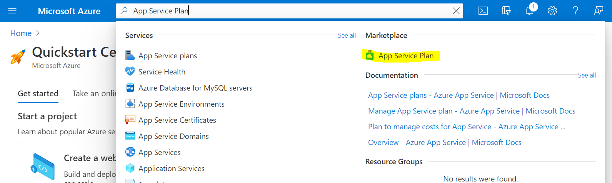
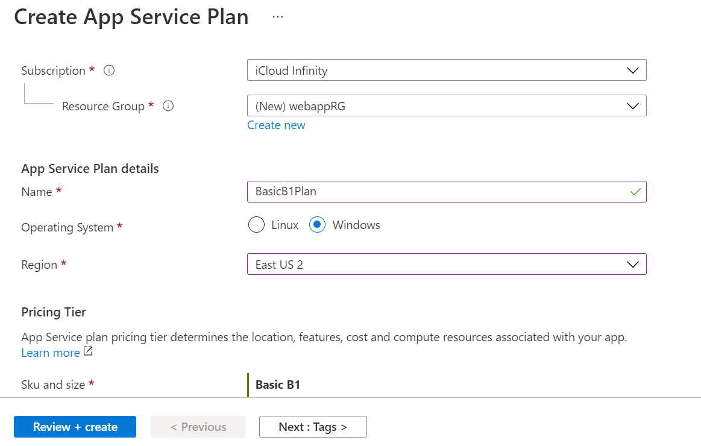

# Introduction

In this section, you will create an App Service Plan in Microsoft Azure.

# Create An App Service Plan

- In the Microsoft Azure portal, search for 'App Service Plan'

- Open the App Service Plan from the **Marketplace**

- Create the App Service Plan

