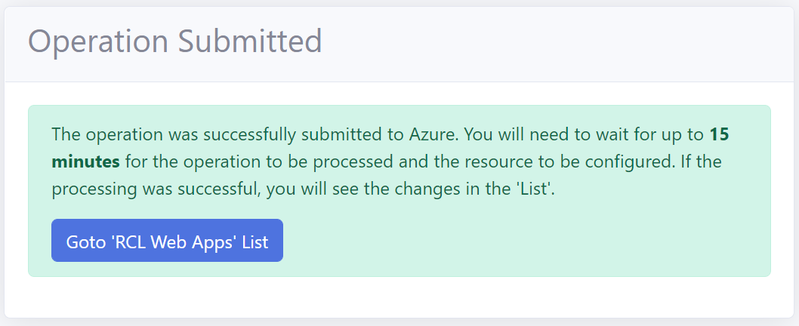

# Introduction

In this section, you will learn how to install DokuWiki as an [Azure App Service](https://docs.microsoft.com/en-us/azure/app-service/overview) in a [Azure App Service Plan](https://docs.microsoft.com/en-us/azure/app-service/overview-hosting-plans) using RCL Web Apps.

# Requirements

An **Azure App Service Plan** is required for this installation. The App Service Plan must be :

- Higher than the **Free** and **Shared** Tier
- A Windows Server

You can refer to this link to [Create an App Service Plan](https://docs.microsoft.com/en-us/azure/app-service/app-service-plan-manage) if you do not have an existing one.

# Installation

## Create The DokuWiki App Service

- In the RCL Web Apps portal, click on the 'Install Web Apps' menu item

- Then click the 'Install' button in the DokuWiki panel

- In the installation page, select the Azure Resource Group and the Azure App Service Plan to install the web app. **The App Service Plan must be higher than the Free and Shared tiers and must be a Windows Server**

- Click the 'Submit' button when you are done

- **You will need to wait 15 minutes for the web app to be completely installed in the App Service Plan, so be patient.**

## Installing DokuWiki

Once the web application is successfully installed in the App Service Plan, you will continue to install DokuWiki.

- Click the 'My Web Apps' menu link, and scroll down to the DokuWiki app

- In the 'Manage' dropdown menu, select 'Launch Web App'

- You should see the DokuWiki page. If you do not see this page, wait for a few more minutes for the app to be installed in the App Service Plan

## Installing OpenCart

- Launch the DokuWiki app

- In the WebBrowser, navigate to the 'install.php' page

- In the installation page enter your desired set up, click the 'Next' button when you are done

## Delete The Installation Directory

For security reasons, you should delete the installation page after the web app is installed.

- Click the 'My Web Apps' menu link, and scroll down to the DokuWiki app

- In the 'Manage' dropdown menu, select ' Use Kudu to configure web app files'

- In Kudu, click on 'CMD' in the 'Debug console'

- Navigate to 'site/wwwroot' and delete the 'install.php' file

# Start Using the Application

- Launch the Admin portal and login

- Click the 'Admin' link and start building your wiki site

