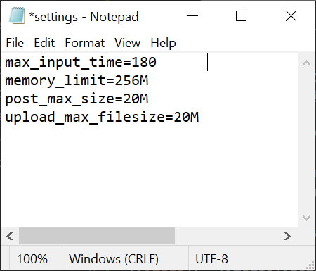
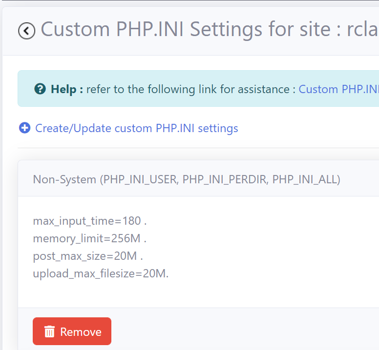
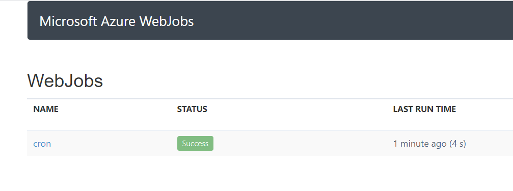

# Introduction

In this section, you will learn how to install EspoCRM as an [Azure App Service](https://docs.microsoft.com/en-us/azure/app-service/overview) in a [Azure App Service Plan](https://docs.microsoft.com/en-us/azure/app-service/overview-hosting-plans) using RCL Web Apps.

# Requirements

An **Azure App Service Plan** is required for this installation. The App Service Plan must be :

- Higher than the **Free** and **Shared** Tier
- A Windows Server

You can refer to this link to [Create an App Service Plan](https://docs.microsoft.com/en-us/azure/app-service/app-service-plan-manage) if you do not have an existing one.

# Installation

## Create The EspoCRM App Service

- In the RCL Web Apps portal, click on the 'Install Web Apps' menu item

- Then click the 'Install' button in the EspoCRM panel


- In the installation page, select the Azure Resource Group and the Azure App Service Plan to install the web app. **The App Service Plan must be higher than the Free and Shared tiers and must be a Windows Server**

- Click the 'Submit' button when you are done


- **You will need to wait 15 minutes for the web app to be completely installed in the App Service Plan, so be patient.**


## Installing EspoCRM

Once the web application is successfully installed in the App Service Plan, you will continue to install EspoCRM.

- Click the 'My Web Apps' menu link, and scroll down to the EspoCRM app

- In the 'Manage' dropdown menu, select 'Launch Web App'


- You should see the EspoCRM install page. If you do not see this page, wait for a few more minutes for the site to be installed in the App Service Plan.


## Custom PHP.INI Settings 

EspoCRM requires custom PHP.INI settings. Follow these instructions to create the settings :

- In the RCL Web Apps portal, click on the 'Manage' button for the EspoCRM web app

- Click on the 'Custom PHP.INI settings' link


- In the 'Custom PHP.INI Settings' page, click on the 'Create/Update custom PHP.INI settings' link


- Create a text file with the following settings :

```bash
max_input_time=180	
memory_limit=256M	
post_max_size=20M	
upload_max_filesize=20M
```



- Save the file with the file name : 'settings.ini'

- In the 'Create/Update Custom PHI.INI' page, select 'Non-System' Type and upload the 'settings.ini' file you created earlier. Click the 'Submit' button when you are done


- In the RCL Web App portal, ensure that the PHI.INI settings is correctly set for EspoCRM

- You will need to restart the app for the settings to take effect



- In the RCL Web Apps portal, click the 'Restart' button for the EspoCRM web app. Wait for few minutes for the app to restart before you continue with the installation


## Setting Up The Database

- Launch the EspoCRM web app and continue the installation

- In the EspoCRM installation page, select the language and click the 'Start' button


- Accept the License Agreement


- You will need to get the database connection settings from the in-app database in the App Service Plan

- In the RCL Web Apps portal, in the EspoCRM web app click the 'Manage' drop down, and click on 'View web app Database Connection and Properties' link


- The database connection is shown below


- Enter the database settings on the EspoCRM installation page. The 'Host Name' should include the port (Full Host)

- Click the 'Test Connection' button 

- When you are done, click the 'Next' button


- Ensure the system requirements (including the custom setting we created earlier) passes the validation tests. Click the 'Next' button to proceed


- Set the Username and Password to login and click the 'Next' button


- Set the 'System Settings' and complete the installation


- Login to the admin portal to start using the web application


## Cron Job

You must verify that the EspoCRM cron jobs are running successfully.

- In the RCL Web Apps portal, in the EspoCRM web app click the 'Manage' drop down, and click on 'Setup Cron jobs' link


- In the 'Cron Jobs' page, click the 'View Cron (Web) Jobs Dashboard


- Ensure the cron jobs are successfully running every 5 minutes




