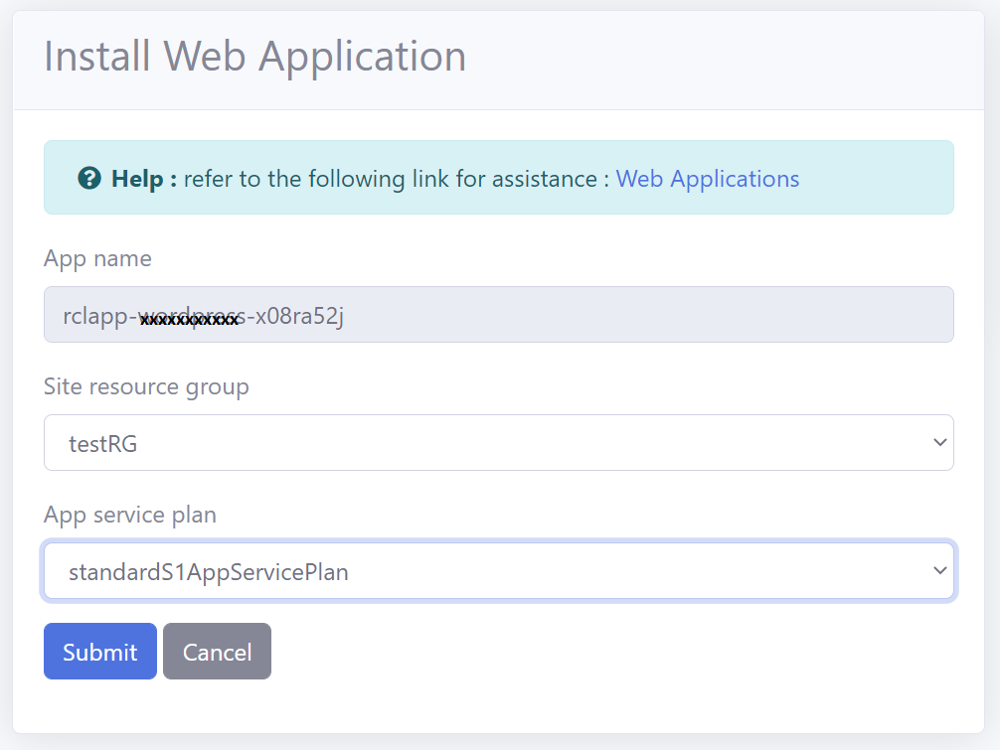

# Introduction

In this section, you will learn how to install OpenCart as an [Azure App Service](https://docs.microsoft.com/en-us/azure/app-service/overview) in a [Azure App Service Plan](https://docs.microsoft.com/en-us/azure/app-service/overview-hosting-plans) using RCL Web Apps.

# Requirements

An **Azure App Service Plan** is required for this installation. The App Service Plan must be :

- Higher than the **Free** and **Shared** Tier
- A Windows Server

You can refer to this link to [Create an App Service Plan](https://docs.microsoft.com/en-us/azure/app-service/app-service-plan-manage) if you do not have an existing one.

# Installation

## Create The OpenCart App Service

- In the RCL Web Apps portal, click on the 'Install Web Apps' menu item

- Then click the 'Install' button in the OpenCart panel

- In the installation page, select the Azure Resource Group and the Azure App Service Plan to install the web app. **The App Service Plan must be higher than the Free and Shared tiers and must be a Windows Server**

- Click the 'Submit' button when you are done.

- **You will need to wait 15 minutes for the web app to be completely installed in the App Service Plan, so be patient.**

## Installing OpenCart

Once the web application is successfully installed in the App Service Plan, you will continue to install OpenCart.

- Click the 'My Web Apps' menu link, and scroll down to the OpenCart app

- In the 'Manage' dropdown menu, select 'Launch Web App'

- You should see the OpenCart install page. If you do not see this page, wait for a few more minutes for the site to be installed in the App Service Plan.

- Accept the license and click the 'Continue' button

- Ensure the pre-installation checks pass and click the 'Continue' button

### Setting Up The Database

- You will need to get the database connection settings from the in-app database in the App Service Plan

- In the RCL Web Apps portal, in the OpenCart web app click the 'Manage' drop down, and click on 'View web app Database Connection and Properties'

- The database connection is shown below

- Enter the database settings on the OpenCart installation page, add the database admin and click the 'Continue' button

- The installation should now complete

## Delete The Installation Directory

For security reasons, you should delete the installation directory after the web app is installed.

- Click the 'My Web Apps' menu link, and scroll down to the OpenCart app

- In the 'Manage' dropdown menu, select ' Use Kudu to configure web app files'

- In Kudu, click on 'CMD' in the 'Debug console'

- Navigate to 'site/wwwroot' and delete the 'install' folder

# Start Using the Application

- Launch the Admin portal and login

- Automatically move the storage directory. This may take some time , so be patient

- Start building your online store in the admin portal

