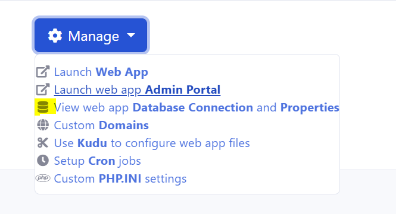
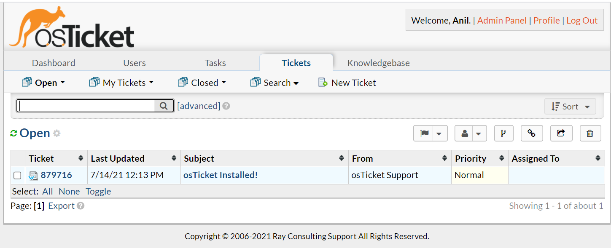

# Introduction

In this section, you will learn how to install osTicket as an [Azure App Service](https://docs.microsoft.com/en-us/azure/app-service/overview) in a [Azure App Service Plan](https://docs.microsoft.com/en-us/azure/app-service/overview-hosting-plans) using RCL Web Apps.

# Requirements

An **Azure App Service Plan** is required for this installation. The App Service Plan must be :

- Higher than the **Free** and **Shared** Tier
- A Windows Server

You can refer to this link to [Create an App Service Plan](https://docs.microsoft.com/en-us/azure/app-service/app-service-plan-manage) if you do not have an existing one.

# Installation

## Create The osTicket App Service

- In the RCL Web Apps portal, click on the 'Install Web Apps' menu item

- Then click the 'Install' button in the osTicket panel


- In the installation page, select the Azure Resource Group and the Azure App Service Plan to install the web app. **The App Service Plan must be higher than the Free and Shared tiers and must be a Windows Server**

- Click the 'Submit' button when you are done


- **You will need to wait 15 minutes for the web app to be completely installed in the App Service Plan, so be patient.**


## Installing osTicket

Once the web application is successfully installed in the App Service Plan, you will continue to install osTicket.

- Click the 'My Web Apps' menu link, and scroll down to the osTicket app

- In the 'Manage' dropdown menu, select 'Launch Web App'


- You should see the osTicket install page. If you do not see this page, wait for a few more minutes for the site to be installed in the App Service Plan


## Custom PHP Extension

osTicket requires the **APCu** extension. Download the extension from the following link :

https://windows.php.net/downloads/pecl/releases/apcu/5.1.20/php_apcu-5.1.20-7.4-nts-vc15-x86.zip

APCu 5.1.20 for Windows, PHP 7.4, Non Thread Safe (NTS) x86

Extract the .dll file from the zip folder.

- In the RCL Web App list, click on the 'Manage' drop down button and click on the 'Custom PHP Extensions' link

- In the Custom PHP Extension page, click the 'Create/Update Custom Extension' link

- Upload the dll file and click the 'Submit' button


- Ensure the PHP extension is installed


- **Restart** the web app and continue the installation

## Basic Installation

- In the osTicket installation page, add the 'System Settings' and 'Admin User'

### Setting Up The Database

- You will need to get the database connection settings from the in-app database in the App Service Plan

- In the RCL Web Apps portal, in the osTicket web app click the 'Manage' drop down, and click on 'View web app Database Connection and Properties'



- The database connection is shown below


- Enter the database settings on the osTicket page. The 'MySQL Hostname' should include the port (Full Host)

- When you are done, click the 'Install Now' button


- The installation will complete


## Set Config File Permission

As a security measure, you should remove the write access permission of the 'ost-config.php' file.

- In the RCL Web Apps portal, in the osTicket web app click the 'Manage' drop down, and click on 'Use Kudu to configure web app files'

- In Kudu, in the 'Debug console' menu, click on the PowerShell link

- Navigate to the 'wwwroot' folder

- In the Command panel, execute the following command

```bash
icacls include\ost-config.php /reset
```


## Cron Job

You must verify that the osTicket cron jobs are running successfully.

- In the RCL Web Apps portal, in the osTicket web app click the 'Manage' drop down, and click on 'Setup Cron jobs' link

- In the 'Cron Jobs' page, click the 'View Cron (web) Jobs Dashboard


- Ensure the cron jobs are successfully running every 5 minutes


## Start Using the Application

- Login to the admin portal and start administering the web application



- Create a ticket in the customer portal


