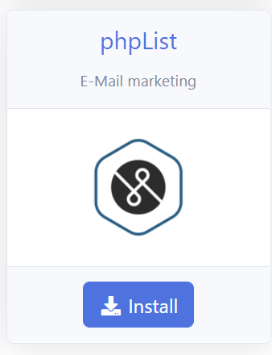
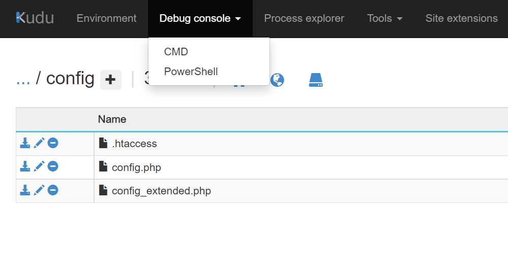
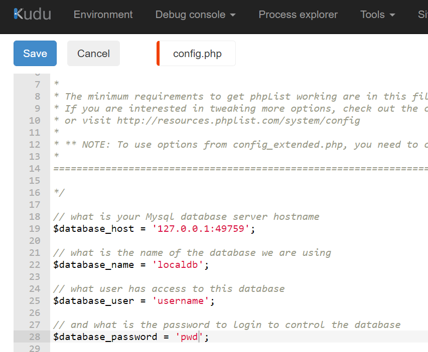
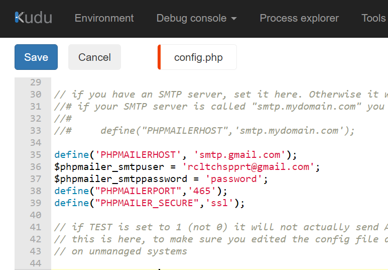
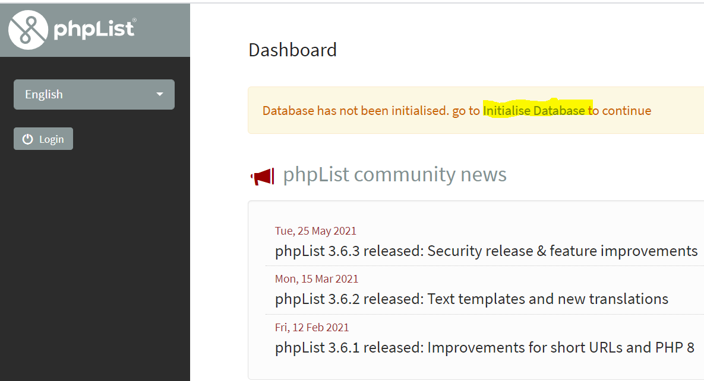
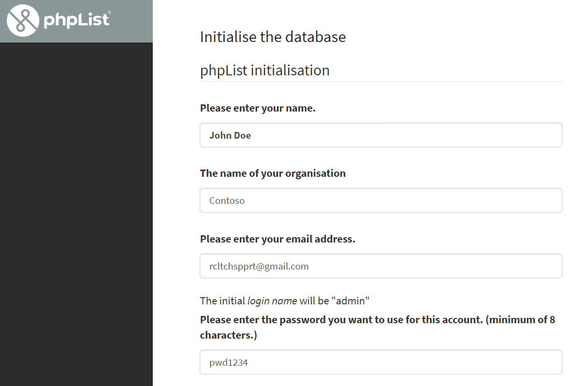
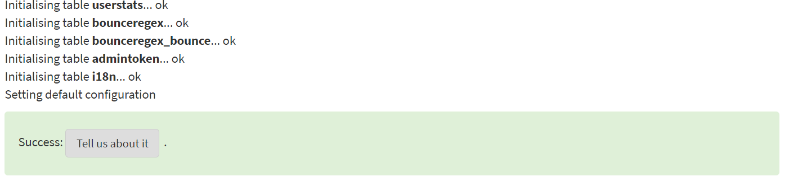
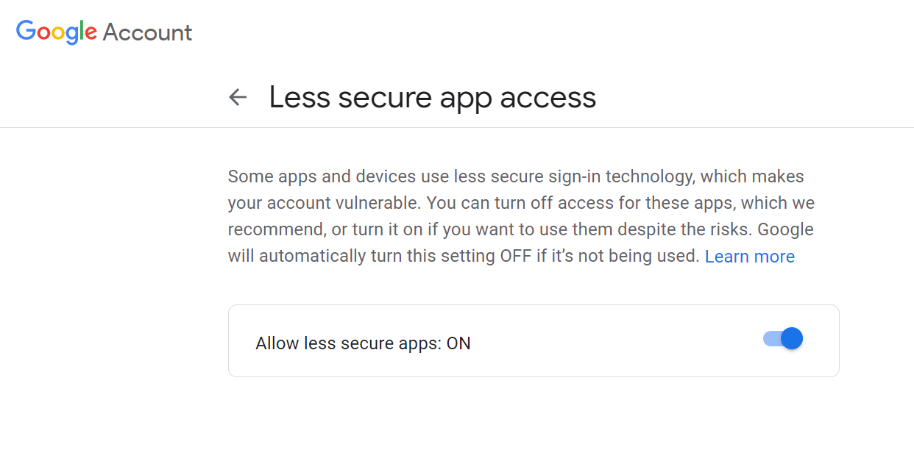
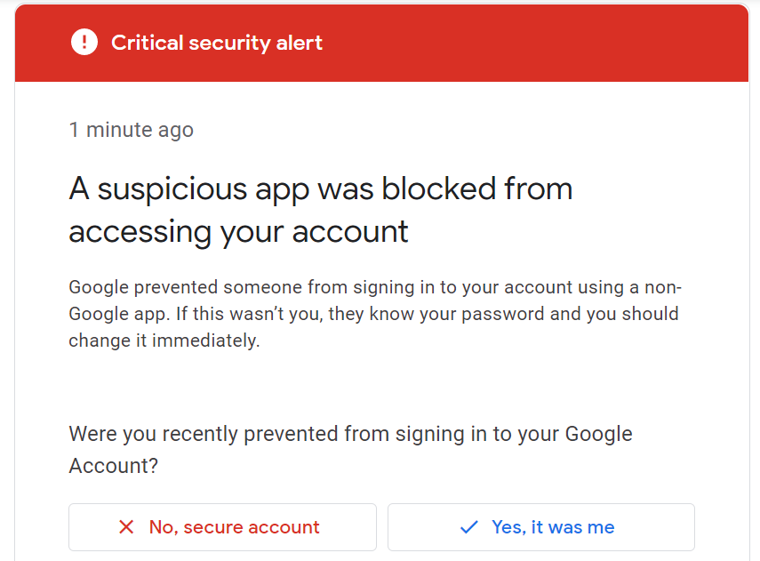
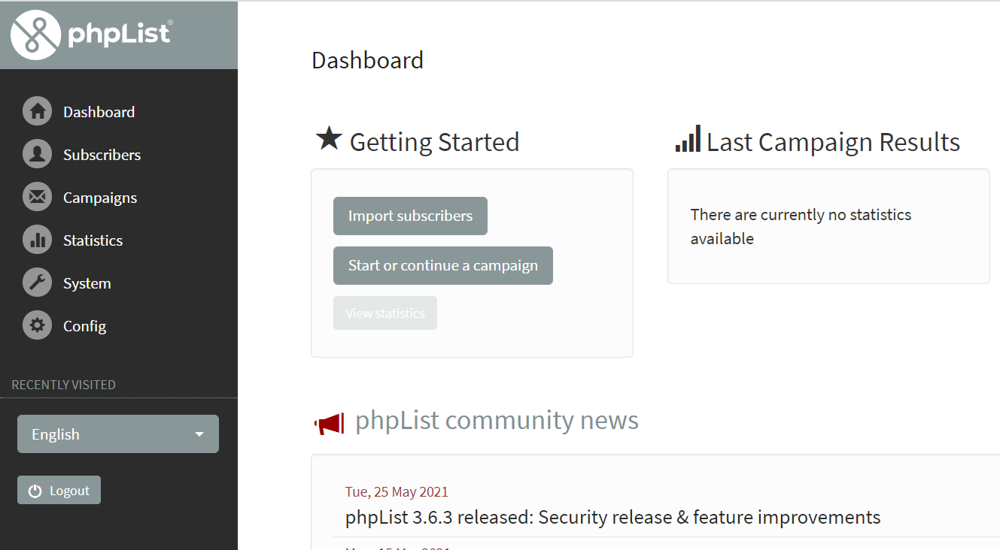

# Introduction

In this section, you will learn how to install phpList as an [Azure App Service](https://docs.microsoft.com/en-us/azure/app-service/overview) in a [Azure App Service Plan](https://docs.microsoft.com/en-us/azure/app-service/overview-hosting-plans) using RCL Web Apps.

# Requirements

An **Azure App Service Plan** is required for this installation. The App Service Plan must be :

- Higher than the **Free** and **Shared** Tier
- A Windows Server

You can refer to this link to [Create an App Service Plan](https://docs.microsoft.com/en-us/azure/app-service/app-service-plan-manage) if you do not have an existing one.

# Installation

## Create The phpList App Service

- In the RCL Web Apps portal, click on the 'Install Web Apps' menu item

- Then click the 'Install' button in the phpList panel

- In the installation page, select the Azure Resource Group and the Azure App Service Plan to install the web app. **The App Service Plan must be higher than the Free and Shared tiers and must be a Windows Server**

- Click the 'Submit' button when you are done.

- **You will need to wait 15 minutes for the web app to be completely installed in the App Service Plan, so be patient.**

## Installing phpList

Once the web application is successfully installed in the App Service Plan, you will continue to install phpList.

### Setting Up The Database

- You will need to get the database connection settings from the in-app database in the App Service Plan

- In the RCL Web Apps portal, in the phpList web app click the 'Manage' drop down, and click on 'View web app Database Connection and Properties'

- The database connection is shown below

- In the 'Manage' drop down, click on 'Use Kudu to configure web app files'

- In Kudu, click on 'CMD' in the 'Debug console' menu link

- Navigate to site/wwwroot/lists/config folder

- Edit the 'config.php' file to set up the database connection

## Setting Up SMTP Email Sender

- Configure an external mail server for handling phpList emails

- The following example shows the settings in the 'config.php' file for sending emails from a Gmail account

- Click the 'Save' button when you are done

## Initializing The Database

- In the RCL Web Apps portal, in the phpList web app click the 'Manage' drop down, and click on 'Launch Web App'

- In the phpList install page, click on the 'Initialise Database' link

- Add the information to initialize the database and click the 'Continue' button when you are done

- Ensure the database is successfully initialized

## Configuring Gmail 

If you are using Gmail to send emails, you will need to [allow less secure apps](https://support.google.com/accounts/answer/6010255?hl=en) in your Google account.

You may need to also resolve Gmail security issues by clicking 'Yes, it was me' link

## Start Using the Application

- Login to the admin Portal and start using the web application

