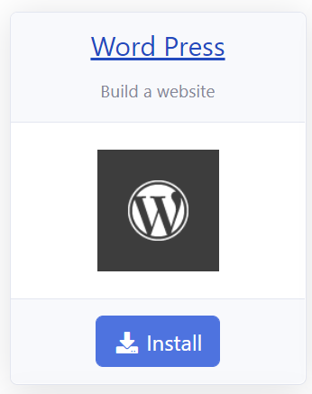

# Introduction

In this section, you will learn how to install WordPress as an [Azure App Service](https://docs.microsoft.com/en-us/azure/app-service/overview) in a [Azure App Service Plan](https://docs.microsoft.com/en-us/azure/app-service/overview-hosting-plans) using RCL Web Apps.

# Requirements

An **Azure App Service Plan** is required for this installation. The App Service Plan must be :

- Higher than the **Free** and **Shared** Tier
- A Windows Server

You can refer to this link to [Create an App Service Plan](https://docs.microsoft.com/en-us/azure/app-service/app-service-plan-manage) if you do not have an existing one.

# Installation

## Create The WordPress App Service

- In the RCL Web Apps portal, click on the 'Install Web Apps' menu item

- Then click the 'Install' button in the WordPress panel

- In the installation page, select the Azure Resource Group and the Azure App Service Plan to install the web app. **The App Service Plan must be higher than the Free and Shared tiers and must be a Windows Server**.

- Click the 'Submit' button when you are done.

- **You will need to wait 15 minutes for the web app to be completely installed in the App Service Plan, so be patient.**

## Installing WordPress

Once the web application is successfully installed in the App Service Plan, you will continue to install WordPress.

- Click the 'My Web Apps' menu link, and scroll down to the WordPress app

- In the 'Manage' dropdown menu, select 'Launch Web App'

- You should see the WordPress install page. If you do not see this page, wait for a few more minutes for the site to be installed in the App Service Plan

- Select the language and click the 'Continue' button.

- Provide the information needed for the installation and click the 'Install WordPress' button

- Wait for a few minutes for the installation to complete. Then, click the 'Log In' button to login to the WordPress Admin Portal

- Enter the UserName and Password that you previously set and click the 'Login' button.

- You can start building your website in the WordPress Admin Portal

